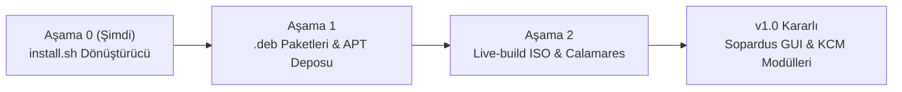

# 🐆 Sopardus

<p align="center">
  <br />
  <strong>Pardus tabanlı, modern, hızlı ve estetik KDE Plasma 6 masaüstü deneyimi.</strong>
  <br />
  <em>Wayland-first • Sıfır Telemetri • Btrfs & Snapper Entegrasyonu • Ember Görsel Kimliği • Tamamen Geri Alınabilir</em>
  <br />
  <br />
</p>

<p align="center">
  
  
  
  
  
</p>

---

## 📖 Genel Bakış

**Sopardus** (*Soleil + Pardus*), **Pardus 25 ("Bilge")** dağıtımını temel alan, modern ve tavizsiz bir **KDE Plasma 6 + Wayland** masaüstü ortamına dönüştüren resmi olmayan bir sistem uzantısı ve geliştirme projesidir.

Pardus'un istikrarlı kurumsal çekirdeği ile KDE Plasma 6'nın çağdaş arayüz kabiliyetlerini, özel **Ember Dark** tema dili, Btrfs/Snapper anlık görüntü (snapshot) güvenlik kalkanı ve oyuncu/geliştirici optimizasyonlarıyla birleştirir.

> [!NOTE]
> **Konumlandırma:** Sopardus bağımsız bir fork değil, Pardus ekosistemi üzerinde çalışan ince ve modüler bir katmandır. GNOME dosyalarını tahrip etmez, tüm işlemleri bir durum matrisine (`/etc/sopardus/install.state`) kaydeder ve tek komutla geriye alınabilir (`--revert`).

---

## ✨ Öne Çıkan Özellikler

- 🚀 **Wayland-First Mimari:** Modern ekran yöneticisi (SDDM) ve saf Wayland oturumu (X11 uyumluluk yedekli).
- 🛡️ **Btrfs & Snapper Güvenliği:** Kurulum öncesi otomatik snapshot alınır; hata veya uyumsuzluk durumunda sisteme zarar vermeden geri dönülür.
- 🔥 **Ember Dark Kimliği:** Sıcak kehribar vurguları, derin füme/mürekkep arka planlar ve zarif tipografi ile özel Look-and-Feel paketi.
- ⚡ **Sistem & Performans Ayarları:** `zstd` sıkıştırmalı ZRAM yapılandırması, optimize edilmiş Baloo dosya indeksleyicisi ve `fstrim.timer` desteği.
- 🎮 **Oyuncu & Donanım Profilleri:** Tek bayrakla GameMode, MangoHud, Gamescope, 32-bit kütüphaneler ve NVIDIA/AMD sürücü desteği.
- 🔒 **Sıfır Telemetri & Tam Güvenlik:** Arka planda kaynak tüketen ağır servisler, takip mekanizmaları ve gereksiz paketler içermez.
- 🔁 **İdempotent & Geri Alınabilir:** Aynı komut birden fazla kez güvenle çalıştırılabilir (`--dry-run` ve `--revert` destekli).

---

## 🏗️ Mimari & Faz Yapısı

Proje aşamalı ve modüler bir yol haritası ile geliştirilmektedir:



### Aşama 0 Akışı (`install.sh`)
1. **00-Preflight:** Dağıtım (`ID=pardus`), donanım (CPU/GPU/VM), disk alanı ve dosya sistemi kontrolleri.
2. **10-Snapshot:** Btrfs alt birim düzeni tespiti (A/B/C) ve Snapper koruma noktası.
3. **20-Packages:** Minimal, optimize edilmiş Plasma 6 paketlerinin kurulumu.
4. **30-Session:** SDDM ekran yöneticisi ve Wayland oturumunun yapılandırılması.
5. **40-Tuning:** ZRAM, fstrim, sysctl ve Baloo optimizasyonları.
6. **50-Theme:** Ember Dark renk şeması, duvar kağıtları ve `/etc/xdg` / `/etc/skel` önayarları.
7. **60-Optional:** Oyun araçları (`--gaming`), NVIDIA sürücüleri (`--nvidia`).
8. **90-Finalize:** Durum kalıcılığı (`install.state`) ve özet rapor.

---

## 🚀 Hızlı Başlangıç

### Gereksinimler
- Temiz veya mevcut **Pardus 25.2 ("Bilge")** 64-bit (amd64) kurulumu
- Minimum 6 GB boş disk alanı
- İnternet bağlantısı

### Kurulum Adımları

1. **Depoyu klonlayın:**
   ```bash
   git clone https://github.com/Xsoleils/sopardus.git
   cd sopardus
   ```

2. **(Opsiyonel) Değişiklikleri önizleyin (Dry-Run):**
   ```bash
   sudo ./install.sh --dry-run
   ```

3. **Kurulumu başlatın:**
   ```bash
   sudo ./install.sh
   ```

4. **Oyun veya Ekran Kartı profilleriyle kurmak için:**
   ```bash
   # Oyun araçlarıyla birlikte kurulum
   sudo ./install.sh --gaming

   # NVIDIA sürücüleri ve oyun araçlarıyla kurulum
   sudo ./install.sh --gaming --nvidia
   ```

5. Kurulum tamamlandıktan sonra bilgisayarınızı yeniden başlatın:
   ```bash
   sudo reboot
   ```

---

## ⚙️ Komut Satırı Bayrakları

| Bayrak | Açıklama |
|---|---|
| `--dry-run` | Sisteme hiçbir şey yazmadan yapılacak adımları simüle eder. |
| `--yes` | Kurulum sırasındaki onay sorularını otomatik onaylar. |
| `--gaming` | GameMode, MangoHud, Gamescope ve 32-bit grafik kütüphanelerini kurar. |
| `--nvidia` | NVIDIA tescilli (proprietary) sürücülerini ve DKMS modüllerini yapılandırır. |
| `--profile NAME` | Donanım profili uygular (`desktop`, `laptop`, `gaming`). |
| `--no-snapshot` | Btrfs/Snapper snapshot adımını atlar (önerilmez). |
| `--revert` | `install.state` dosyasını okuyarak sistemi önceki masaüstü/DM durumuna geri döndürür. |

---

## 📂 Proje Yapısı

```
sopardus/
├── install.sh              # Ana çalıştırılabilir dönüştürücü betik
├── lib/
│   ├── common.sh           # Ortak fonksiyonlar, loglama ve state yönetimi
│   ├── 00-preflight.sh     # Sistem, donanım ve uyumluluk kontrolleri
│   ├── 10-snapshot.sh      # Btrfs/Snapper snapshot yönetimi
│   ├── 20-packages.sh      # Plasma 6 paket kurulum modülü
│   ├── 30-session.sh       # SDDM & Wayland oturum yapılandırması
│   ├── 40-tuning.sh        # ZRAM, sysctl ve servis optimizasyonu
│   ├── 50-theme.sh         # Ember teması, duvar kağıtları ve dotfile'lar
│   ├── 60-optional.sh      # Gaming ve GPU ek modülleri
│   └── 90-finalize.sh      # Durum kaydı ve sonlandırma
├── packages/
│   ├── core.list           # Minimal Plasma 6 paket listesi
│   ├── gaming.list         # Oyun araçları paket listesi
│   └── nvidia.list         # NVIDIA sürücü paket listesi
├── assets/
│   └── theme/              # Ember renk şablonları ve tema dosyaları
├── docs/                   # Mimari belgeleri ve tasarım kayıtları
├── tests/                  # Bats birim testleri ve sanal makine senaryoları
├── LICENSE                 # GPL-3.0-or-later lisansı
└── README.md               # Proje tanıtım belgesi
```

---

## 🗺️ Yol Haritası

- [x] **Aşama 0 (Mevcut):** Modüler `install.sh`, Ember Dark renk şeması, ZRAM/Tuning, Snapper entegrasyonu, `--revert` kabiliyeti.
- [ ] **Aşama 1:** `sopardus-*` `.deb` paket ekosistemi, yerel/uzak APT deposu, `sopardus` CLI aracı (`update`, `rollback`, `doctor`).
- [ ] **Aşama 2:** Canlı (Live-Build) ISO imajları, Calamares özelleştirilmiş kurulum sihirbazı.
- [ ] **v1.0 Kararlı:** Sopardus Ayarlar KCM modülü, Snapshots GUI, Driver Manager, Gaming Hub ve Plasma Backport hattı.

---

## ⚖️ Yasal Uyarı & Lisans

- **Yasal Uyarı:** *Pardus*, TÜBİTAK'ın tescilli markasıdır. Sopardus, bağımsız topluluk çalışması olup TÜBİTAK veya Pardus resmi projesi ile doğrudan kurumsal bir bağı bulunmamaktadır.
- **Yazılım Lisansı:** Bu projenin kodları [GNU General Public License v3.0 or later (GPL-3.0-or-later)](file:///home/soleil/solpro/sopardus/LICENSE) ile lisanslanmıştır.
- **Görsel Varlıklar:** Özel simgeler, temalar ve duvar kağıtları **Creative Commons BY-SA 4.0** lisansına tabidir.

---

<p align="center">
  Geliştirici: <strong>Soleil</strong> • <a href="https://github.com/Xsoleils">@Xsoleils</a>
</p>
